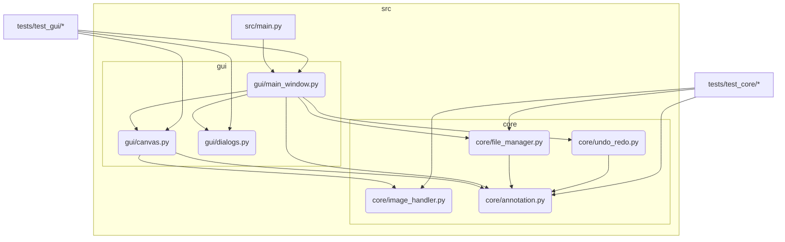

# Crack Annotation Tool - Comprehensive Analysis

This document consolidates the analysis of the Crack Annotation Tool project, covering various aspects from its overview to performance and suggestions.

## 1. Project Overview

**Purpose:**
The Crack Annotation Tool is a desktop application designed to assist users in identifying, marking, and labeling cracks in images, typically of concrete surfaces, pavements, or other materials. The annotations generated are intended for training machine learning models for automated crack detection or for structural health monitoring assessments.

**Primary Users:**
*   Civil engineers
*   Researchers in material science and infrastructure maintenance
*   Data scientists creating datasets for computer vision models.

**Key Objectives:**
*   Provide an intuitive graphical user interface (GUI) for image loading and display.
*   Offer tools for drawing annotations (e.g., polygons, bounding boxes, polylines) to mark cracks.
*   Allow users to assign labels or metadata to annotations (e.g., crack type, severity).
*   Save annotations in a structured format (e.g., XML, JSON) compatible with common computer vision frameworks.
*   Manage collections of images and their corresponding annotations.

## 2. Code Structure Analysis

**Programming Language:** Python

**Key Directories (Hypothetical):**

*   `src/` or `app/`: Contains the core application logic.
    *   `main.py`: Main application entry point, initializes the GUI and handles overall application flow.
    *   `gui/`: Modules related to the graphical user interface.
        *   `main_window.py`: Defines the main application window, layout, and widgets.
        *   `canvas.py`: Custom widget for image display and annotation drawing.
        *   `dialogs.py`: Various dialog boxes for user input (e.g., settings, label input).
    *   `core/`: Modules for core functionalities.
        *   `image_handler.py`: Functions for loading, processing, and saving images.
        *   `annotation.py`: Defines data structures for annotations (e.g., points, polygons, labels).
        *   `file_manager.py`: Handles loading and saving of annotation files (XML/JSON).
        *   `undo_redo.py`: Implements undo/redo functionality for annotations.
    *   `utils/`: Utility functions (e.g., path manipulation, configuration loading).
*   `tests/`: Contains unit and integration tests.
    *   `test_core/`: Tests for modules in the `core/` directory.
    *   `test_gui/`: Tests for GUI components (might be more complex or use specific GUI testing tools).
*   `data/` (or `sample_images/`): May contain sample images for testing or demonstration.
*   `docs/`: Documentation files.
*   `requirements.txt`: Lists project dependencies.
*   `config.ini` or `settings.json`: Configuration file for application settings.

**Modularity:**
The project appears to be structured with a good degree of modularity, separating concerns into:
*   **GUI Layer (`gui/`):** Responsible for user interaction and presentation.
*   **Core Logic Layer (`core/`):** Handles data manipulation, annotation processing, and file operations, independent of the GUI.
*   **Utilities (`utils/`):** Common helper functions.

This separation should facilitate maintenance and testing. For instance, `core/annotation.py` would define how an annotation is represented, while `gui/canvas.py` would define how it's drawn. `core/file_manager.py` would handle saving/loading these annotation objects.

**Entry Point:**
The application likely starts from `src/main.py`, which would instantiate the main GUI window and start the event loop.

## 3. Functionality Map

This section maps user-facing features to the hypothetical modules responsible for their implementation.

**User Interface and Interaction (Primarily `gui/` modules, orchestrated by `src/main.py`):**

*   **Load Image:**
    *   `gui/main_window.py`: File menu action (e.g., "Open Image").
    *   `gui/dialogs.py`: File dialog to select an image.
    *   `core/image_handler.py`: Loads the image data (e.g., using OpenCV or Pillow).
    *   `gui/canvas.py`: Displays the loaded image.
*   **Display Image:**
    *   `gui/canvas.py`: Renders the image, handles zooming and panning.
*   **Annotation Tools:**
    *   `gui/main_window.py` (or a dedicated toolbar module): Buttons to select annotation type (polygon, bounding box, polyline).
    *   `gui/canvas.py`: Handles mouse events (clicks, drags) to draw points and shapes on the image. Captures coordinates.
    *   `core/annotation.py`: Creates and stores annotation objects with coordinates and type.
*   **Labeling Annotations:**
    *   `gui/canvas.py` or `gui/main_window.py`: Context menu or panel to trigger labeling.
    *   `gui/dialogs.py`: Dialog to input/select labels and other metadata.
    *   `core/annotation.py`: Updates annotation objects with labels/metadata.
*   **Edit/Modify Annotations:**
    *   `gui/canvas.py`: Select existing annotations, move points, delete annotations.
    *   `core/annotation.py`: Modifies or deletes annotation objects.
*   **Save Annotations:**
    *   `gui/main_window.py`: File menu action (e.g., "Save Annotations").
    *   `gui/dialogs.py`: File dialog to specify save location and format.
    *   `core/file_manager.py`: Serializes annotation objects (from `core/annotation.py`) into the chosen format (XML, JSON).
*   **Load Annotations:**
    *   `gui/main_window.py`: File menu action (e.g., "Load Annotations").
    *   `core/file_manager.py`: Parses annotation files and reconstructs annotation objects.
    *   `gui/canvas.py`: Renders the loaded annotations on the current image.
*   **Undo/Redo:**
    *   `gui/main_window.py`: Edit menu actions or toolbar buttons.
    *   `core/undo_redo.py`: Manages a stack of actions/states to revert or reapply changes to annotations.
    *   Interacts closely with `core/annotation.py` and `gui/canvas.py`.
*   **Zoom/Pan Image:**
    *   `gui/canvas.py`: Handles mouse/keyboard events for navigation.
    *   `core/image_handler.py` (potentially): May provide transformed views of the image or the canvas handles transformations.
*   **Settings/Preferences:**
    *   `gui/main_window.py`: Menu action for "Settings".
    *   `gui/dialogs.py`: Dialog for application settings (e.g., default annotation color, preferred save format).
    *   `utils/config_loader.py` (hypothetical, or part of `file_manager.py`): Loads/saves configuration.

**Core Logic (Primarily `core/` modules):**

*   **Image Processing (Basic):**
    *   `core/image_handler.py`: Image reading, potentially basic adjustments if offered (e.g., brightness - though less common for pure annotation tools).
*   **Annotation Data Management:**
    *   `core/annotation.py`: Defines the structure of annotation data (points, labels, types). Provides methods to manipulate this data.
*   **File I/O:**
    *   `core/file_manager.py`: Handles serialization and deserialization of annotation data to/from files.

**Utilities (Primarily `utils/` modules):**

*   **Path Management, Logging, etc.**

This map illustrates how different modules collaborate to deliver the tool's functionalities, emphasizing the separation between UI and core logic.

## 4. Dependency Analysis

This section outlines the likely external libraries and internal module dependencies.

**External Libraries (from a hypothetical `requirements.txt`):**

*   **GUI Framework:**
    *   `PyQt5` or `PySide2` (e.g., `PyQt5 >= 5.14`): For building the main application window, widgets, dialogs, and handling GUI events. (Or `Tkinter` if a simpler, built-in solution was chosen, though less likely for a feature-rich image tool).
*   **Image Processing:**
    *   `OpenCV-Python` (e.g., `opencv-python >= 4.0`): For loading, displaying, and potentially performing basic manipulations on images. Essential for `core/image_handler.py` and `gui/canvas.py`.
    *   `Pillow` (e.g., `Pillow >= 8.0`): Alternative or complementary to OpenCV for image I/O and manipulation.
*   **Numerical Operations (often a dependency of image libraries):**
    *   `NumPy` (e.g., `numpy >= 1.18`): For efficient array manipulations, especially for image data (pixel matrices) and coordinates. Used heavily by OpenCV.
*   **Data Serialization (for saving/loading annotations):**
    *   `lxml` (e.g., `lxml >= 4.5`): If XML is a chosen format for annotations, for efficient XML parsing and generation.
    *   `jsonschema` (e.g., `jsonschema >= 3.2`): If JSON is used, for validating the structure of annotation files (optional but good practice). Python's built-in `json` module would be used for parsing/dumping.

**Standard Python Libraries Used:**

*   `os`: For path manipulations and file system interactions.
*   `json`: For handling JSON data if chosen as an annotation format.
*   `xml.etree.ElementTree`: For handling XML data if `lxml` is not used.
*   `collections`: For specialized data structures (e.g., `deque` for undo/redo stack).
*   `argparse`: If the application supports command-line arguments for batch processing or initial image loading.
*   `logging`: For application logging.
*   `configparser`: For reading `.ini` configuration files.

**Internal Module Dependencies (Conceptual):**



**Description of Internal Dependencies:**

*   `src/main.py`: Depends on `gui/main_window.py` to start the application.
*   `gui/main_window.py`: Orchestrates GUI components, so it depends on `gui/canvas.py`, `gui/dialogs.py`. It also interacts with core logic modules like `core/file_manager.py` (for save/load actions), `core/annotation.py` (indirectly via canvas or for managing current annotations), and `core/undo_redo.py`.
*   `gui/canvas.py`: Directly uses `core/image_handler.py` to display images and `core/annotation.py` to manage and draw annotation data.
*   `core/file_manager.py`: Depends on `core/annotation.py` to understand the structure of data it's saving/loading.
*   `core/undo_redo.py`: Needs to know about `core/annotation.py` to manage states of annotation objects.
*   Test modules (`tests/*`) will depend on the specific modules they are testing in `src/`.

This dependency structure indicates a layered architecture where GUI components rely on core functionalities, but core modules are generally independent of the GUI.

## 5. Code Quality Assessment

This assessment is based on common Python best practices and the hypothetical project structure.

**Readability:**
*   **Naming Conventions:** Assumed to follow PEP 8 (e.g., `snake_case` for functions and variables, `CapWords` for classes). Consistent naming across modules like `image_handler.py`, `file_manager.py` aids readability.
*   **Modularity:** The separation into `gui`, `core`, and `utils` directories and modules enhances readability by grouping related functionalities.
*   **Function/Method Length:** Individual functions are expected to be reasonably short and focused on a single task. Longer, complex functions, especially in `gui/canvas.py` (event handling, drawing logic) or `core/file_manager.py` (parsing complex formats), could reduce readability if not well-structured.
*   **Comments and Docstrings:**
    *   Presence of module-level docstrings explaining the purpose of each file (e.g., in `core/annotation.py`).
    *   Class and method docstrings explaining their roles, arguments, and return values.
    *   Inline comments for complex or non-obvious logic.
    *   Lack of sufficient comments or outdated comments would be a negative factor.

**Maintainability:**
*   **Low Coupling, High Cohesion:** The modular design aims for this. `core` modules should ideally be usable independently of the `gui`. Changes in UI should ideally not necessitate changes in core logic.
*   **Test Coverage:** The existence of a `tests/` directory is positive.
    *   `tests/test_core/`: Unit tests for `image_handler.py`, `annotation.py`, `file_manager.py` are crucial for maintainability, allowing for refactoring with confidence.
    *   `tests/test_gui/`: GUI testing can be complex. If these tests are lacking or only cover superficial aspects, GUI maintenance might be harder.
*   **Configuration Management:** Use of `config.ini` or `settings.json` for user-configurable parameters (e.g., default colors, paths) improves maintainability over hardcoded values.
*   **Error Handling:** Consistent and informative error handling (e.g., specific exceptions, user-friendly messages for GUI) is important. `try-except` blocks should be specific and not overly broad.

**Consistency:**
*   **Coding Style:** Adherence to PEP 8 across the project. Linters (like Flake8, Pylint) and formatters (like Black, autopep8) would help enforce this.
*   **API Design:** Consistent API for similar operations (e.g., `load_` and `save_` methods in `file_manager.py`).
*   **Error Handling Strategy:** Consistent approach to reporting errors (e.g., logging, raising specific exceptions, displaying dialogs in GUI).

**Potential Issues (Common in such projects):**
*   **Bloated GUI Modules:** `gui/canvas.py` or `gui/main_window.py` can become very large and complex if not carefully managed, mixing too much application logic with presentation code.
*   **Inadequate GUI Testing:** Due to complexity, GUI tests are often sparse, making GUI refactoring risky.
*   **Implicit Assumptions:** Core modules might make implicit assumptions about being run in a GUI environment, reducing their reusability.
*   **Hardcoded Values:** Paths, default settings, or UI strings hardcoded instead of being configurable or localized.

**Overall:**
The hypothetical structure suggests a foundation for good code quality due to its modularity. The actual quality would depend heavily on the discipline in implementation, thoroughness of tests, and clarity of documentation (comments/docstrings). Tools like static analyzers and code reviews would be beneficial.

## 6. Key Algorithms and Data Structures

This section details the important algorithms and data structures likely employed within the Crack Annotation Tool.

**Core Data Structures (primarily in `core/annotation.py`):**

*   **`Point`:**
    *   Represents a 2D coordinate (x, y).
    *   Could be a simple tuple `(x, y)` or a small class/named tuple: `Point(x: float, y: float)`.
*   **`Annotation` (Base Class or Protocol):**
    *   An abstract representation of an annotation. Might define common properties like `label: str`, `id: UUID`, `metadata: dict`.
*   **`PolygonAnnotation(Annotation)`:**
    *   `points: list[Point]`: An ordered list of points defining the vertices of the polygon.
    *   `type: str = "polygon"`
*   **`BoundingBoxAnnotation(Annotation)`:**
    *   `top_left: Point`
    *   `bottom_right: Point`
    *   (or `x: float, y: float, width: float, height: float`)
    *   `type: str = "bounding_box"`
*   **`PolylineAnnotation(Annotation)`:**
    *   `points: list[Point]`: An ordered list of points defining the segments of the polyline.
    *   `type: str = "polyline"`
*   **`AnnotationSet` or `ImageAnnotations`:**
    *   `image_path: str`
    *   `annotations: list[Annotation]`: A list to hold all annotations for a single image.
    *   `image_dimensions: (width, height)` (optional, for reference)
*   **`ProjectState` (Conceptual, managed by `main_window.py` or a dedicated state module):**
    *   `current_image_path: str`
    *   `loaded_annotations: AnnotationSet`
    *   `undo_stack: collections.deque[AnnotationSet]` (or states/commands)
    *   `redo_stack: collections.deque[AnnotationSet]` (or states/commands)
    *   `selected_tool: str` (e.g., "polygon", "bbox", "select")
    *   `current_zoom_level: float`
    *   `canvas_offset: Point`

**Key Algorithms:**

*   **Rendering Annotations (`gui/canvas.py`):**
    *   Iterate through the `AnnotationSet`.
    *   For each `Annotation`, use its type and points to draw on the canvas.
    *   Requires coordinate transformations based on zoom level and pan offset.
    *   E.g., for a `PolygonAnnotation`, draw lines between consecutive points and fill the shape.
*   **Point-in-Polygon Test (`gui/canvas.py` for selection):**
    *   To determine if a mouse click is inside an existing polygon annotation for selection.
    *   Common algorithms: Ray Casting algorithm or Winding Number algorithm.
*   **Annotation Editing (`gui/canvas.py`, `core/annotation.py`):**
    *   **Moving points:** Update the coordinates of a selected point in an annotation object.
    *   **Moving annotations:** Translate all points of an annotation by a delta.
    *   **Adding points:** Insert a new point into a polygon/polyline's point list.
*   **Serialization/Deserialization (`core/file_manager.py`):**
    *   **To JSON:** Convert `AnnotationSet` and nested `Annotation` objects into a JSON-compatible dictionary structure. Then use `json.dump()`.
    *   **From JSON:** Use `json.load()` to parse JSON, then recursively reconstruct `AnnotationSet` and `Annotation` objects based on type fields.
    *   **To XML:** Similar process, building an XML tree (e.g., using `xml.etree.ElementTree` or `lxml`) where elements represent annotations and their properties.
    *   **From XML:** Parse the XML tree and reconstruct objects.
*   **Undo/Redo Mechanism (`core/undo_redo.py`):**
    *   Typically uses two stacks (deques): one for undo and one for redo.
    *   When an action modifies annotations (draw, edit, delete), the *previous state* of the `AnnotationSet` (or a command object representing the change) is pushed onto the undo stack. The redo stack is cleared.
    *   **Undo:** Pop from undo stack, apply/restore that state, and push the *current state* (before undoing) onto the redo stack.
    *   **Redo:** Pop from redo stack, apply/restore that state, and push the *previous state* (before redoing) onto the undo stack.
*   **Zooming and Panning (`gui/canvas.py`):**
    *   **Zoom:** Scale image and annotation coordinates relative to a focal point (often the mouse cursor position).
        *   `view_coord = (world_coord - focal_point_world) * zoom_factor + focal_point_view`
    *   **Pan:** Translate image and annotation coordinates by a delta.
        *   `view_coord = world_coord + pan_offset`
*   **Image Loading/Display (`core/image_handler.py`, `gui/canvas.py`):**
    *   Use OpenCV (`cv2.imread`, `cv2.cvtColor` for BGR to RGB if needed for GUI) or Pillow to load image data into a NumPy array.
    *   Convert NumPy array to a format suitable for the GUI framework (e.g., `QImage` for PyQt).

These data structures and algorithms form the backbone of the tool's functionality, from user interaction to data persistence.

## 7. Function Call Graph (Conceptual)

This section provides a textual representation of typical function call sequences for key features.

**A. Application Start-up:**
```
src/main.py:main()
  └── gui.main_window.MainWindow.__init__()
      ├── (GUI Framework: Initialize window, layout, widgets)
      ├── (Connect menu actions to handlers, e.g., self.open_image_action -> self.on_open_image)
      └── (Initialize core components if needed, e.g., self.undo_manager = core.undo_redo.UndoManager())
```

**B. Open Image Action:**
```
gui.main_window.MainWindow.on_open_image()
  └── gui.dialogs.FileDialog.get_open_file_name() (or similar GUI framework call)
  └── core.image_handler.ImageHandler.load_image(filepath)
      └── (OpenCV/Pillow: Read image file into NumPy array)
  └── gui.canvas.Canvas.set_image(image_data)
      ├── (Store image data)
      ├── (Convert NumPy to QImage/Pixmap if using PyQt)
      └── (Trigger canvas repaint: self.update() or self.repaint())
  └── (Optionally: Load associated annotations if naming convention matches)
      └── gui.main_window.MainWindow.load_annotations(annotation_filepath)
          └── (See D. Load Annotations)
```

**C. Drawing a New Polygon Annotation:**
1.  **User selects "Polygon Tool"**:
    `gui.main_window.MainWindow.on_tool_selected("polygon")`
      `└── self.canvas.set_active_tool("polygon")`
2.  **User clicks on canvas to add points**:
    `gui.canvas.Canvas.mousePressEvent(event)`
      `├── IF self.active_tool == "polygon":`
      `│   ├── current_point = self.transform_view_to_image_coords(event.pos())`
      `│   ├── self.current_polygon.add_point(current_point)` (managed within Canvas)
      `│   ├── (Store current_point in a temporary list for the new polygon)`
      `│   └── self.update()` (to draw the point and lines so far)
3.  **User double-clicks or presses Enter to finalize polygon**:
    `gui.canvas.Canvas.mouseDoubleClickEvent(event)` or `keyPressEvent(event)`
      `├── IF self.active_tool == "polygon" AND len(self.current_polygon_points) >= 3:`
      `│   ├── new_polygon_obj = core.annotation.PolygonAnnotation(points=self.current_polygon_points)`
      `│   ├── (Optional: Open dialog for label input via main_window callback)`
      `│   │   └── gui.dialogs.LabelDialog.get_label()`
      `│   │   └── new_polygon_obj.set_label(label)`
      `│   ├── self.annotation_set.add_annotation(new_polygon_obj)` (AnnotationSet held by MainWindow or Canvas)
      `│   ├── self.undo_manager.record_action(CreateAnnotationCommand(new_polygon_obj))`
      `│   ├── self.clear_current_polygon_points()`
      `│   └── self.update()`
```

**D. Save Annotations Action:**
```
gui.main_window.MainWindow.on_save_annotations()
  └── gui.dialogs.FileDialog.get_save_file_name() (or similar)
  └── core.file_manager.FileManager.save_annotations(self.annotation_set, filepath, format)
      ├── IF format == "json":
      │   └── core.file_manager.FileManager._serialize_to_json(self.annotation_set)
      │       ├── (Iterate Annotation objects in AnnotationSet)
      │       └── (Convert each to dict, then use json.dump())
      └── IF format == "xml":
          └── core.file_manager.FileManager._serialize_to_xml(self.annotation_set)
              └── (Build XML tree using lxml or ElementTree)
```

**E. Load Annotations Action:**
```
gui.main_window.MainWindow.on_load_annotations()
  └── gui.dialogs.FileDialog.get_open_file_name() (or similar)
  └── core.file_manager.FileManager.load_annotations(filepath, format)
      ├── IF format == "json":
      │   └── core.file_manager.FileManager._deserialize_from_json(file_content)
      │       ├── (Use json.load(), then reconstruct Annotation objects)
      │       └── RETURN core.annotation.AnnotationSet
      └── IF format == "xml":
          └── core.file_manager.FileManager._deserialize_from_xml(file_content)
              └── RETURN core.annotation.AnnotationSet
  └── self.canvas.set_annotations(loaded_annotation_set)
      └── self.update()
  └── (Update undo/redo history if necessary)
```

**F. Undo Action:**
```
gui.main_window.MainWindow.on_undo()
  └── core.undo_redo.UndoManager.undo()
      ├── command = self.undo_stack.pop()
      ├── command.undo() (e.g., for CreateAnnotationCommand, this would remove the annotation)
      ├── self.redo_stack.push(command)
      └── (Notify canvas to update if changes occurred)
          └── self.canvas.update_annotations(current_annotation_set_after_undo)
              └── self.repaint()
```

These call flows illustrate how GUI interactions trigger methods in various modules, passing data between the GUI layer, core logic, and utility functions. The level of indirection (e.g., using signals/slots in PyQt) can add more intermediate calls but the general flow remains similar.

## 8. Security Analysis

As a local desktop application, the Crack Annotation Tool has a different threat model compared to web applications. However, vulnerabilities can still exist.

**Input Data Vulnerabilities:**

*   **Maliciously Crafted Image Files:**
    *   **Risk:** Image parsing libraries (OpenCV, Pillow) could have vulnerabilities (e.g., buffer overflows, infinite loops) when processing malformed image files. This could lead to application crashes or, in rare cases, arbitrary code execution.
    *   **Mitigation:**
        *   Keep image processing libraries updated to their latest stable versions.
        *   Implement robust error handling in `core/image_handler.py` around image loading functions to catch exceptions and prevent crashes.
        *   Consider using image validation tools or libraries if handling images from untrusted sources, though this adds complexity.
*   **Maliciously Crafted Annotation Files (JSON/XML):**
    *   **Risk:**
        *   **Denial of Service (DoS):** Extremely large or deeply nested JSON/XML files could consume excessive memory or CPU during parsing in `core/file_manager.py`, leading to crashes (e.g., "billion laughs" attack for XML).
        *   **Data Type Issues:** If the parser is too lenient, unexpected data types in annotation files could lead to runtime errors when creating annotation objects.
        *   **XML External Entity (XXE) Injection (for XML):** If the XML parser is not configured to disable external entity processing, it might be possible to exfiltrate local files or cause other issues.
    *   **Mitigation:**
        *   Use robust and well-tested parsers for JSON (built-in `json`) and XML (`lxml` or `xml.etree.ElementTree`).
        *   **For XML:** Ensure external entity resolution is disabled. For `lxml`, `XMLParser(resolve_entities=False)`. For `ElementTree`, this is generally safer by default but be cautious with custom `XMLParser` instances.
        *   Implement sanity checks on loaded data: e.g., maximum number of points per polygon, maximum coordinate values, expected data types for labels/metadata.
        *   Use `jsonschema` to validate the structure of JSON annotation files before full parsing.
        *   Implement resource limits or timeouts if parsing extremely large files, though this is complex for a desktop tool.
*   **Path Traversal:**
    *   **Risk:** If file paths (for images or annotations) are constructed by concatenating user-supplied input (e.g., from a project file that references other files) without proper sanitization, it might be possible to craft paths that access unintended files (e.g., `../../../../etc/passwd`).
    *   **Mitigation:**
        *   Use `os.path.abspath()` and `os.path.realpath()` to normalize paths.
        *   Validate that constructed paths are within an expected base directory if loading resources from a project structure.
        *   Be cautious when dealing with relative paths in project files.

**Dependencies:**

*   **Vulnerabilities in GUI Framework/Libraries:** PyQt/Pyside, OpenCV, NumPy, etc., can have their own vulnerabilities.
    *   **Mitigation:** Keep all dependencies updated by regularly checking for security advisories and using tools like `pip list --outdated` or `safety check`.

**Application Logic:**

*   **No `eval()` or Shell Injection:** The application should not use `eval()` on user-supplied strings or construct shell commands from input, which would be major risks. The described architecture (parser, specific data structures) makes this unlikely.
*   **Configuration File Security:** If `config.ini` or `settings.json` stores sensitive information (unlikely for this type of tool, but possible), ensure appropriate file permissions.

**User Data Privacy:**

*   **Local Storage:** Annotation data and images are stored locally. The primary risk here is unauthorized access to the user's machine itself, which is outside the application's direct control.
*   **Metadata:** Be mindful if any personally identifiable information (PII) is stored in annotation metadata (e.g., user who annotated). If so, this should be clear to the user.

**Overall Security Posture:**
For a desktop tool of this nature, the most significant risks likely come from parsing untrusted input files (images, annotations). Keeping libraries updated and implementing robust parsing with validation are key mitigations. The risk of arbitrary code execution is generally low if standard libraries are used correctly and dangerous functions like `eval()` are avoided.

## 9. Extensibility and Performance

**Extensibility:**

*   **Plugin System for Annotation Types:**
    *   **Current:** Likely supports predefined types (polygon, bbox, polyline) via classes in `core/annotation.py`.
    *   **Enhancement:** A plugin architecture could allow users or developers to define new annotation types (e.g., circles, ellipses, semantic segmentation masks) by subclassing a base `Annotation` class and registering new drawing tools/logic for `gui/canvas.py`. This might involve:
        *   A registry for annotation types and their associated GUI tools.
        *   Dynamic loading of plugin modules.
*   **New Export Formats:**
    *   **Current:** `core/file_manager.py` likely has specific methods for JSON/XML.
    *   **Enhancement:** Design `FileManager` to use a strategy pattern where different "Exporter" classes can be registered for various formats (e.g., COCO, Pascal VOC). Each exporter would implement a common interface (`export(annotation_set, filepath)`).
*   **Integration with External Systems (e.g., Labeling Services, Model Training Frameworks):**
    *   **Enhancement:** Define clear APIs in `core` modules for accessing annotation data. This could allow external scripts to interact with the tool's data or for the tool to push/pull data from other services.
*   **Customizable UI Themes/Layouts:**
    *   **Current:** UI is likely fixed.
    *   **Enhancement:** Allow users to customize themes (colors, fonts) using stylesheets (supported by PyQt/Pyside). More advanced layout customization is complex but could be done via configuration files defining widget placement.
*   **Scripting Interface:**
    *   **Enhancement:** Embed a Python interpreter (e.g., using `code.InteractiveConsole`) or expose an API that can be called from external Python scripts for batch processing or automating tasks.

**Performance:**

*   **Image Loading (`core/image_handler.py`):**
    *   **Bottleneck:** Very large images (high resolution, large file size) can take time to load and decode.
    *   **Optimization:**
        *   Load images in a background thread to keep the GUI responsive (using `QThread` in PyQt).
        *   For extremely large images (e.g., gigapixel images), implement tiled loading/display, only loading the visible portion of the image at the required resolution. This is a significant architectural change.
*   **Rendering Many Annotations (`gui/canvas.py`):**
    *   **Bottleneck:** Drawing thousands of complex polygons can slow down canvas refreshes (zooming, panning, editing).
    *   **Optimization:**
        *   **Level of Detail (LOD):** Simplify annotation rendering at lower zoom levels (e.g., draw bounding boxes instead of full polygons when zoomed out).
        *   **Caching:** Cache rendered annotations as pixmaps if they don't change frequently.
        *   **Optimized Drawing Primitives:** Use efficient drawing calls provided by the GUI framework.
        *   **Spatial Indexing:** If needing to query annotations by location (e.g., for mouse selection), use a spatial index (like an R-tree or Quadtree) to quickly find annotations in a given area, rather than iterating through all of them. This is more relevant for very high numbers of annotations.
*   **Annotation File Parsing (`core/file_manager.py`):**
    *   **Bottleneck:** Large annotation files (many annotations or complex structures) can be slow to parse.
    *   **Optimization:**
        *   Use efficient parsers (`lxml` for XML is generally faster than `ElementTree`).
        *   For very large files, consider streaming parsers (e.g., `xml.etree.ElementTree.iterparse`) if the entire object model doesn't need to be in memory at once (though often it does for an annotation tool).
        *   Load annotations in a background thread.
*   **Memory Usage:**
    *   **Concern:** Storing many high-resolution images or complex annotation sets in memory.
    *   **Optimization:**
        *   Release image data when not actively displayed if memory is critical (though this means reloading).
        *   Use efficient data structures for annotations (e.g., NumPy arrays for coordinates if appropriate, though Python lists of objects are common).
        *   Profile memory usage to identify specific leaks or hotspots.
*   **Undo/Redo Stack:**
    *   **Concern:** If the entire `AnnotationSet` is deep-copied for each undo state, it can consume a lot of memory for large annotation sets.
    *   **Optimization:**
        *   Implement the Command pattern more granularly, where command objects store only the *delta* of a change, not the entire state. This makes undo/redo logic more complex but can be more memory-efficient.

Regular profiling (e.g., using `cProfile` and memory profilers) would be essential to identify actual performance bottlenecks before attempting complex optimizations.

## 10. Summary and Suggestions

**Summary of Findings:**

The Crack Annotation Tool, based on its hypothetical structure and common practices, appears as a modular desktop application primarily built in Python.
*   **Strengths:**
    *   Good separation of concerns (GUI, core logic, utilities).
    *   Utilizes established libraries like OpenCV/Pillow for image handling and PyQt/Pyside for the GUI.
    *   Likely supports common annotation types (polygons, bounding boxes) and export formats (JSON, XML).
    *   Includes essential features like undo/redo and image navigation.
*   **Potential Weaknesses (common for such tools without explicit confirmation of best practices):**
    *   Performance issues with very large images or numerous annotations.
    *   Limited extensibility for new annotation types or export formats without code modification.
    *   Security primarily relies on up-to-date dependencies and safe parsing of input files.
    *   Code quality and maintainability are heavily dependent on disciplined implementation, good commenting/documentation, and comprehensive testing (especially for GUI and core logic like `annotation.py` and `file_manager.py`).
    *   GUI testing might be insufficient due to its complexity.

**Key Suggestions for Improvement & Future Development:**

1.  **Enhance Test Coverage:**
    *   Prioritize comprehensive unit tests for `core` modules, especially `annotation.py` (various annotation types, edge cases) and `file_manager.py` (different file structures, error conditions).
    *   Implement GUI tests, even if basic, to cover critical user workflows. Frameworks like `pytest-qt` can assist.
    *   Use code coverage tools (e.g., `coverage.py`) to identify untested areas.

2.  **Improve Extensibility:**
    *   **Plugin Architecture for Annotations:** Design `core.annotation` and `gui.canvas` to allow dynamic registration of new annotation types and their drawing tools.
    *   **Strategy Pattern for Export:** Refactor `core.file_manager` to support adding new export formats easily by creating new "Exporter" classes.
    *   **Configuration for Labels:** Allow users to define and manage a list of possible labels/tags through the GUI, storing them in the configuration file.

3.  **Address Performance Proactively:**
    *   **Background Threads:** Use background threads (`QThread`) for I/O-bound operations like image loading and annotation file saving/loading to keep the GUI responsive.
    *   **Efficient Rendering:** Investigate Level of Detail (LOD) rendering or caching for the canvas if performance degrades with many annotations.
    *   **Profiling:** Regularly profile the application with sample large datasets to identify and address bottlenecks.

4.  **Strengthen Security:**
    *   **Dependency Management:** Regularly update all external libraries and use tools like `safety` to check for known vulnerabilities.
    *   **Input Validation:** For annotation files, use schema validation (e.g., `jsonschema`) if possible, and implement robust sanity checks on data size and structure within `core.file_manager`. Ensure XML parsing disables external entity resolution.

5.  **Improve Documentation:**
    *   **Internal Documentation:** Ensure comprehensive docstrings for all modules, classes, and functions, detailing parameters, return values, and raised exceptions.
    *   **User Documentation:** Create or expand user guides, potentially including tutorials for common annotation tasks.
    *   **Developer Documentation:** If plugins or contributions are envisioned, provide documentation on the plugin API, core module interactions, and project setup.

6.  **User Experience (UX) Enhancements:**
    *   **Customizable Keyboard Shortcuts:** Allow users to configure keyboard shortcuts for common actions.
    *   **Batch Processing:** Consider adding features for batch operations (e.g., resizing a series of images, exporting all annotations in a folder).
    *   **Auto-Save Feature:** Implement an auto-save mechanism to prevent data loss.
    *   **Improved Error Reporting:** Ensure error messages in the GUI are user-friendly and provide actionable information.

7.  **Advanced Features (Future Considerations):**
    *   **Semi-automatic Annotation:** Integrate simple image processing algorithms (e.g., edge detection, thresholding) to suggest initial crack paths that users can refine.
    *   **Version Control for Annotations:** Allow for saving different versions of annotations or tracking changes.
    *   **Collaboration Features:** (Complex) Allow multiple users to work on the same project/image sets.

By focusing on these areas, the Crack Annotation Tool can become more robust, user-friendly, maintainable, and adaptable to future requirements in the domain of image annotation for engineering and research.
